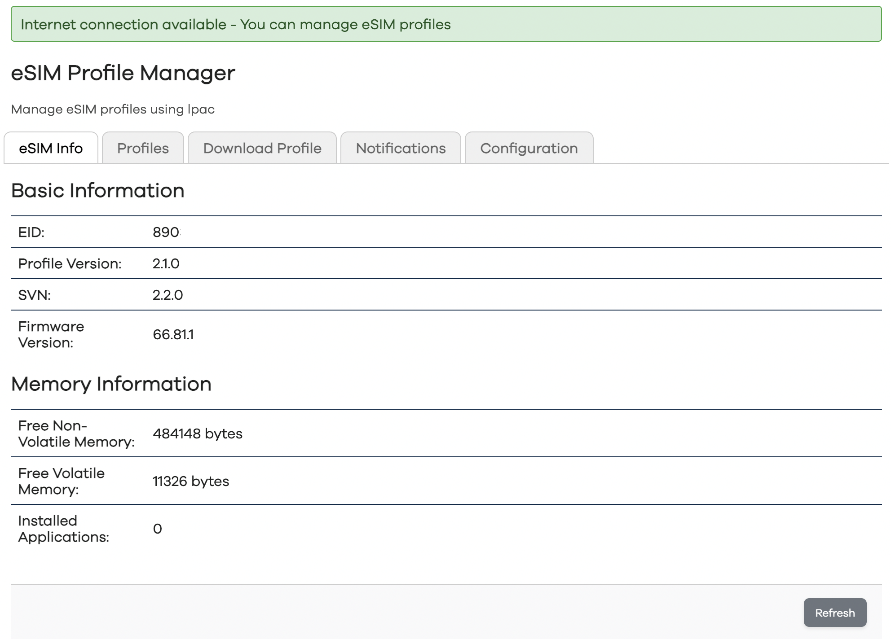
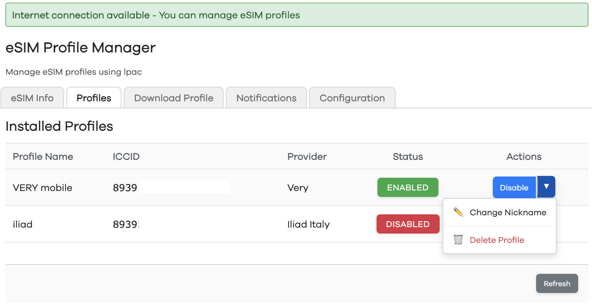
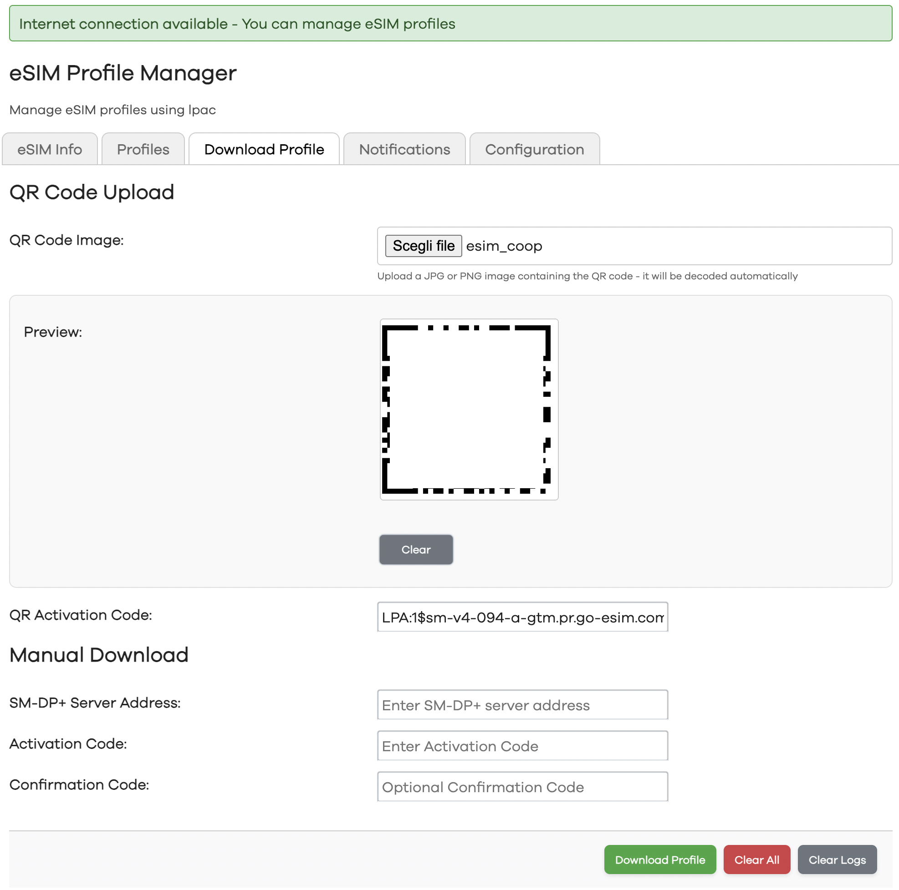
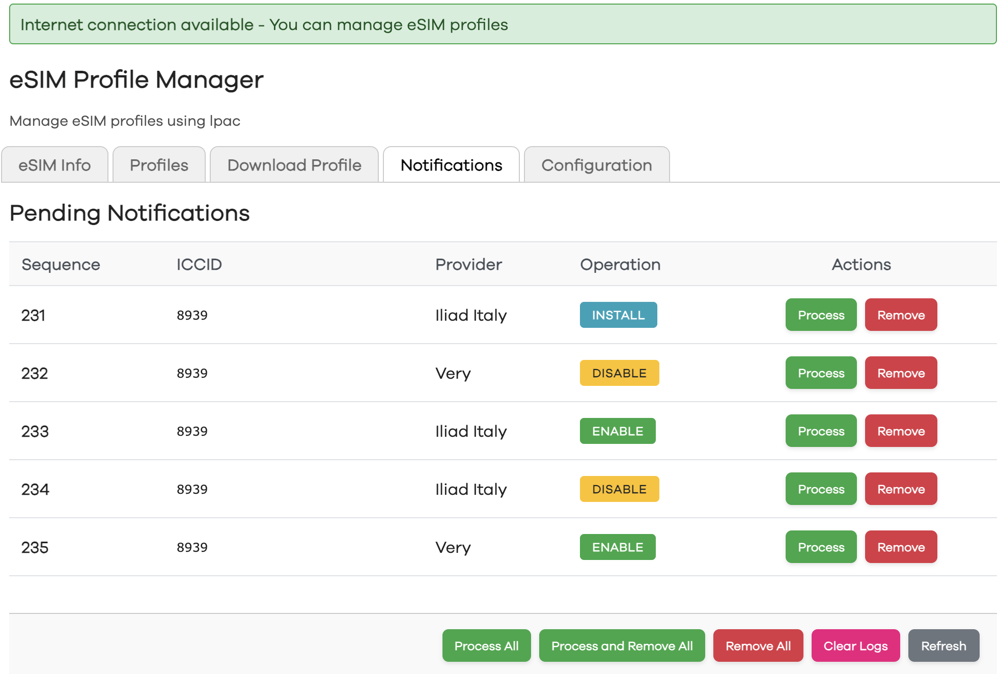
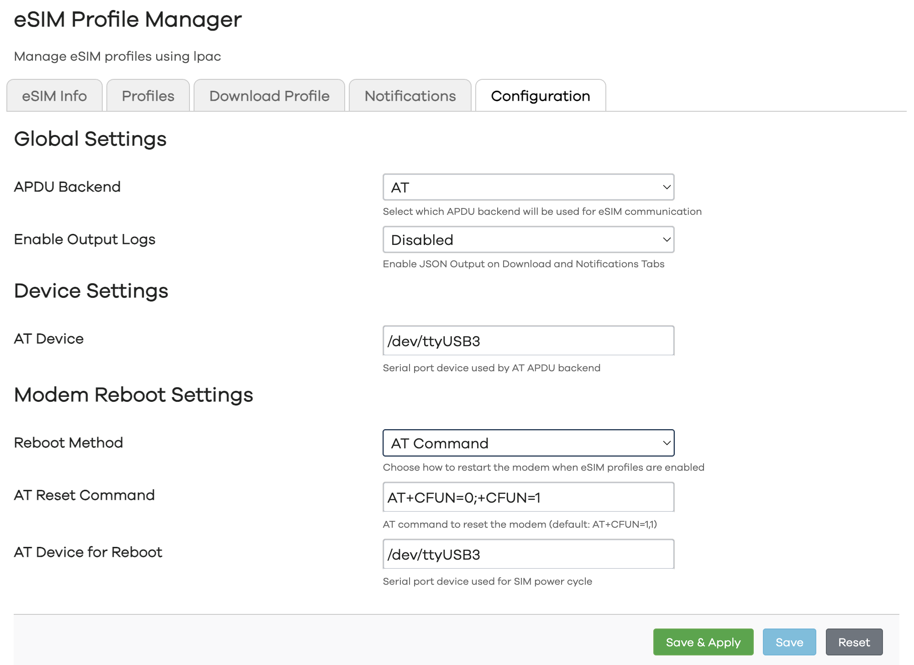
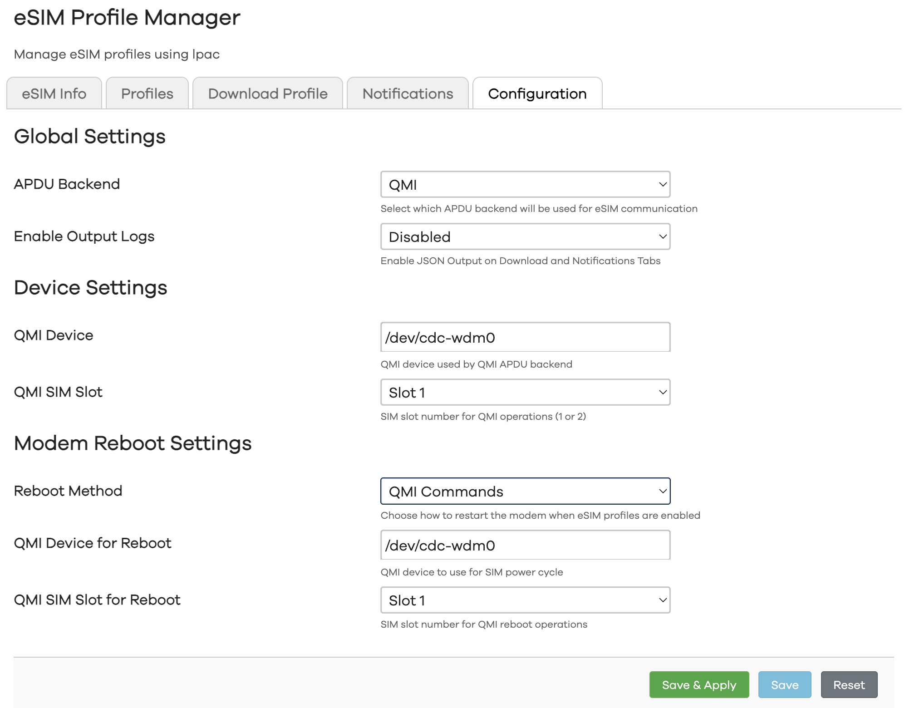
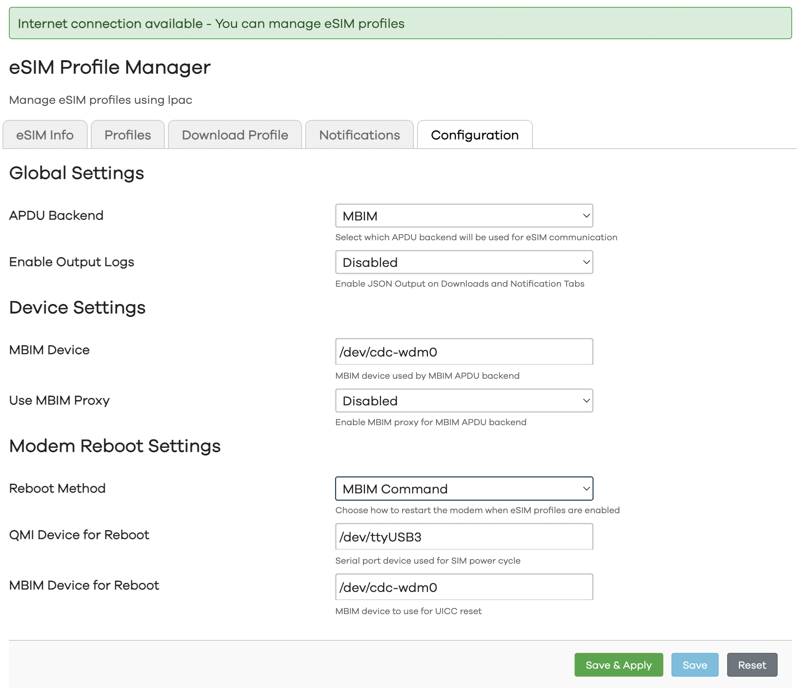

# LuCI Web Interface App for managing eSIM profiles via lpac

## 🎯 **What does this app do?**

**luci-app-epm** is a LuCI web interface for OpenWrt that allows easy management of eSIM profiles on compatible cellular modules. The application uses **lpac** (Local Profile Agent Client) to communicate with eSIM modules and provides an intuitive user interface for:

- 📊 **Monitor Status** of eSIM module
- 📥 **Download Profiles** via QR codes or manual entry  
- 🔄 **Manage Existing Profiles** (enable/disable/delete/rename)
- 🪛 **Configure LPAC backend and Modem Reboot** (via AT, QMI, MBIM or Custom command)
- 🔔 **Notifications** for status and operations
- 🌐 **Connectivity Testing** before managing eSIM profiles

**🚀 Happy eSIM managing!** If the app is useful to you, leave a ⭐ on GitHub!
> **Remember**: This is a community-driven project. Every contribution, big or small, is valuable! 💝

## 🛠️ **Requirements**

- OpenWrt with LuCI interface
- Packages `lpac`, `uqmi`, `mbimcli` and `coreutils-timeout` installed
- Cellular module with eSIM (physical or embedded) support
- Internet connection (for profile download and delete)

## 📋 **Tested Modules and eSIMs**

The following table shows modules on which the application has been tested:

# Modem Compatibility Table

<table>
    <thead>
        <tr>
            <th rowspan="2">Modem Tested</th>
            <th colspan="2">e-SIM</th>
            <th colspan="3">APDU backend</th>
            <th rowspan="2">Firmware<br>ATI Output</th>
            <th rowspan="2">Reboot Method</th>
        </tr>
            <tr>
                <th>Internal</th>
                <th>External</th>
                <th>AT</th>
                <th>MBIM</th>
                <th>QMI</th>
        </tr>
    </thead>
    <tbody>
            <tr>
                <td class="modem-name">Foxconn T99W175 (MV31-W)</td>
                <td class="status-ok">✓</td>
                <td class="status-ok">✓</td>
                <td class="status-error">❌</td>
                <td class="status-ok">✓</td>
                <td class="status-error">❌</td>
                <td class="firmware">F0.1.0.0.9.GC.004</td>
                <td>AT and MBIM</td>
            </tr>
            <tr>
                <td class="modem-name">Quectel RM502Q-GL</td>
                <td>N/A</td>
                <td class="status-ok">✓</td>
                <td class="status-ok">✓</td>
                <td class="status-ok">✓</td>
                <td class="status-ok">✓</td>
                <td class="firmware">RM502QGLAAR11A02M4G</td>
                <td>AT, QMI and MBIM</td>
            </tr>
            <tr>
                <td class="modem-name">Quectel RM551E-GL</td>
                <td>N/A</td>
                <td class="status-ok">✓</td>
                <td class="status-warning">⚠️</td>
                <td class="status-error">❌</td>
                <td class="status-warning">⚠️</td>
                <td class="firmware">RM551EGL00AAR01A03M8G</td>
                <td>AT and QMI</td>
            </tr>
        </tbody>
</table>
        
<div class="legend">
    <h2>Legend</h2>
        <ul>
            <li><span class="status-ok">✓</span> = Supported/Working</li>
            <li><span class="status-error">❌</span> = Not supported/Error</li>
            <li><span class="status-warning">⚠️</span> = Warning/Limited support</li>
            <li><span class="status-unknown">?</span> = Unknown/To be tested</li>
            <li>N/A = Not applicable</li>
        </ul>
</div>

Quectel **RM551E-GL** is still in ES stage, and its firmware has some problems during eSIM operation.
The following eSIMs were used as *Physical eSIM*:

1. [Lenovo eSIM](https://www.lenovo.com/it/it/p/accessories-and-software/mobile-broadband/4g-lte/4xc1l91362?srsltid=AfmBOop-6ZZktt9NIWFjj99BT6kyo4igJQ5mnAFZWyVHKY5bqYa6glcE)
2. [EIOTCLUB eSIM](https://www.eiotclub.com/products/physical-esim-card)

> **Note**: If you've tested the app with other modules/eSIMs, please share your experience via Issue or PR!

## 📸 **Screenshots**

### Main Dashboard

*Main view with eSIM status*

### Profile Management

*List and management of installed eSIM profiles*

### Profile Download

*Download new profiles via QR code or manual entry*

### Notifications List

*List and management of all notifications on eSIM*

### Configuration
*Configuration panel for lpac binary and reboot commands (you can mix them, are not restricted)*


*AT Mode*

*QMI Mode*

*MBIM Mode*

## 🚀 **Installation**

You can download latest ipk from Release Page and install using the command:

`opkg install luci-app-epm_1.0.0-r1_all.ipk`


## 🎨 **Compile by yourself**

Add next line to `feeds.conf.default` in OpenWrt SDK/Buildroot:

`src-git epm https://github.com/stich86/luci-app-epm.git`

Update feeds and compile the package:

```./scripts/feeds update -a; ./scripts/feeds install -a
make -j$((`nproc` + 1)) package/feeds/epm/luci-app-epm/compile
```

The compiled package will be at:

`SDKROOT/bin/packages/aarch64_cortex-a53/epm/luci-app-epm_1.0.0-r1_all.ipk`

### Project structure

```
➜  luci-app-epm:
.
├── htdocs
│   └── luci-static
│       └── resources		// CSS, JS
├── luasrc
│   ├── controller		// LuCI LUA controller
│   ├── model
│   │   └── cbi         	// CBI model
│   └── view
│       └── epm 		// HTML templates
└── root
    ├── etc
    │   └── config 		// Configuration file
    └── usr
        └── share
            └── menu.d  	// Menu definition

```

## 🤝 **Contributing**

This application was developed using **vibecoding** and may contain non-perfect optimizations or improvable code.
Contributions are **very welcome**! 
 

### How to contribute:

1. **🐛 Bug Reports**: Found a bug? Open an [Issue](https://github.com/stich86/luci-app-epm/issues)
2. **💡 Feature Requests**: Have an idea to improve the app? Share it via Issue
3. **🔧 Pull Requests**: Fixed something or added functionality? Submit a PR!
4. **📝 Documentation**: Help improve docs and README
5. **🧪 Testing**: Test on different modules/eSIMs and share results


## 🙏 **Acknowledgments**

- **[estkme-group](https://github.com/estkme-group/lpac)** for the fantastic lpac eSIM client
- **[cozmo](https://github.com/cozmo/jsQR)** for his JavaScript QRCode library 
- **[OpenWrt community & LuCI developers](https://openwrt.org/)** for the ecosystem 
- **Vibecoding** for... the vibe! 🎵
