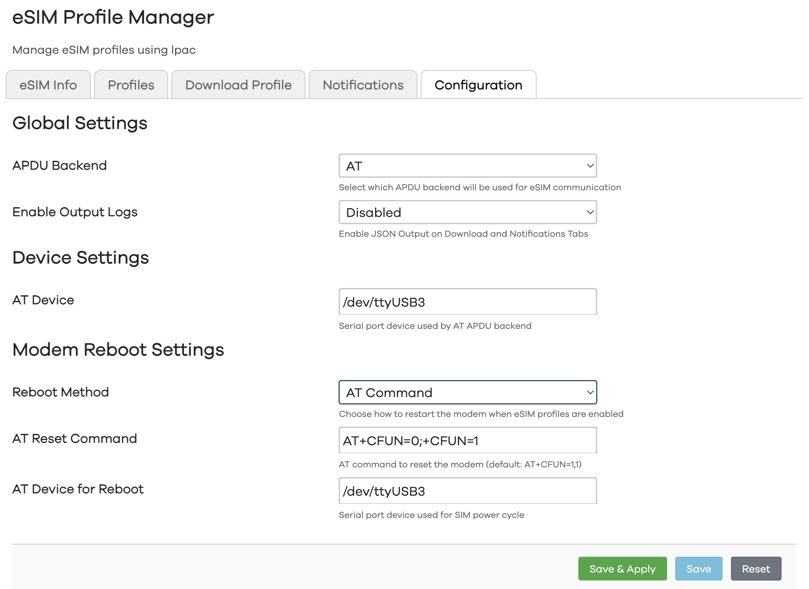
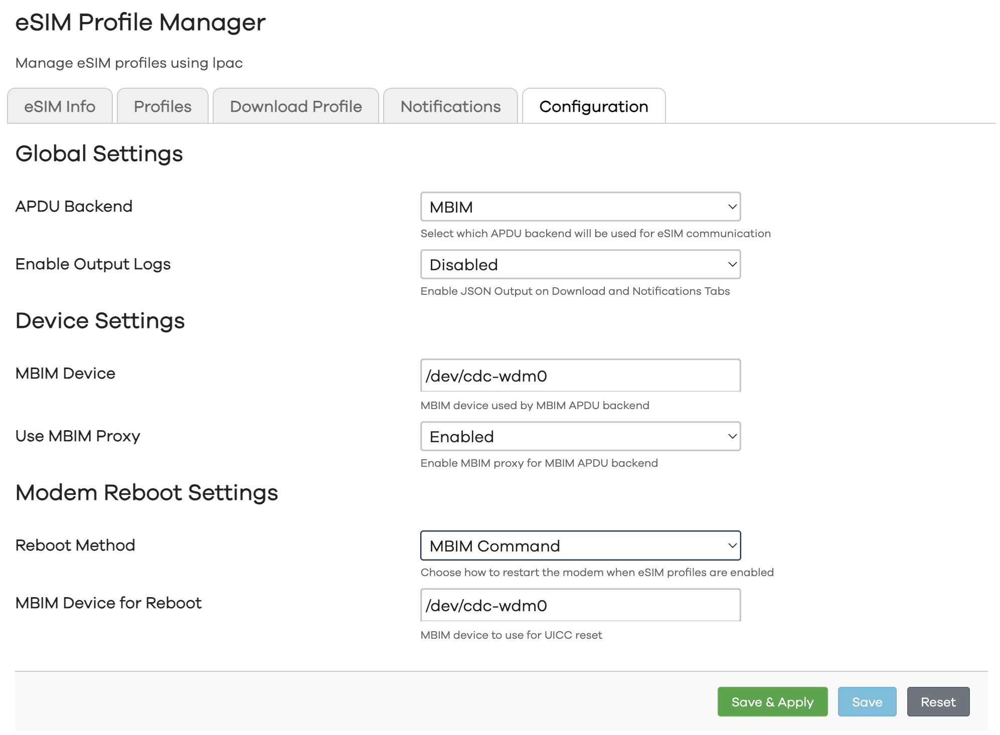

## 📸 **Screenshots**

📱 Main Dashboard

*Main view with eSIM status*

👤 Profile Management

*List and management of installed eSIM profiles*

⬇️ Profile Download

*Download new profiles via QR code or manual entry*

🔔 Notifications List

*List and management of all notifications on eSIM*

### Configuration
*Configuration panel for lpac binary and reboot commands (you can mix them, are not restricted)*

⚙️ AT Mode

⚙️ QMI Mode

⚙️ MBIM Mode

